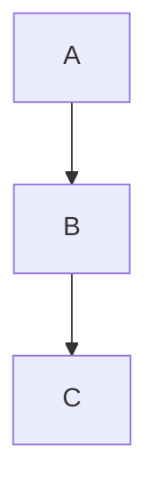

# MkDocs Playground

> This page serves as the permanent testing environment for Markdown, MkDocs Material features, PyMdown extensions, and custom CSS used throughout Sovereign Codex.

---

# Headings

# H1

## H2

### H3

#### H4

---

# Text

**Bold**

*Italic*

~~Strikethrough~~

`Inline code`

---

# Lists

## Bullet List

- Item One
- Item Two
- Item Three

## Numbered List

1. One
2. Two
3. Three

## Nested List

- Parent
    - Child
        - Grandchild

---

# Task Lists

- [x] Complete
- [ ] In Progress
- [ ] Future

---

# Block Quote

> This is a block quote.

---

# Horizontal Rule

---

# Tables

| Name | Description |
|------|-------------|
| SVG | Vector Graphics |
| CSS | Styling |
| YAML | Configuration |

---

# Code Blocks

## Plain Text

```text
Hello Sovereign
```

## YAML

```yaml
site_name: Sovereign Codex
```

## CSS

```css
.hero {
    color: white;
}
```

## HTML

```html
<div>Hello</div>
```

## Python

```python
print("Hello")
```

---

# Admonitions

!!! note

    This is a note.

!!! tip

    Helpful information.

!!! warning

    Warning message.

!!! danger

    Danger message.

!!! success

    Success message.

!!! info

    Informational content.

!!! question

    Question box.

!!! example

    Example content.

---

# Details / Dropdown

??? note "Expandable"

    Hidden until clicked.

???+ tip "Expanded"

    Open by default.

---

# Tabs

=== "Python"

    ```python
    print("Hello")
    ```

=== "CSS"

    ```css
    body {}
    ```

---

# Buttons

[GitHub](https://github.com){ .md-button }

[Primary](#){ .md-button .md-button--primary }

---

# Keyboard Keys

Press ++ctrl+c++

Press ++ctrl+shift+p++

---

# Emoji

:rocket:

:material-home:

:material-github:

---

# Definition Lists

Term

: Definition

---

# Footnotes

This is a sentence.[^1]

[^1]: Example footnote.

---

# Images


---

# Mermaid



---

# Custom Classes

<div class="hero-banner">

Hero Banner

</div>

---

# HTML

<details>
<summary>HTML Details</summary>

Works using raw HTML.

</details>

---

# SVG Example

```svg
<svg>
...
</svg>
```

## Inkscape

- Ctrl + drag corner preserves proportions.
- Double-click path adds node.
- Guides can be rotated.
- Boolean Difference removes geometry.
- Mirror before redrawing.

## MkDocs

- ```text``` for plain text blocks.
- ??? creates dropdowns.
- ???+ expands by default.
- ++ctrl+c++ renders keyboard keys.