## Characteristics

- Warm rather than bright
- Ages gracefully
- Gains character over time
- Cast and machined finishes
- Soft reflections
- Rich surface texture
- Premium without excess

---

## Design Translation

Bronze should be used sparingly.

It signifies importance rather than decoration.

Applications include:

- Metadata
- Section accents
- Dividers
- Status indicators
- Small decorative details

Avoid using bronze as a dominant interface colour.

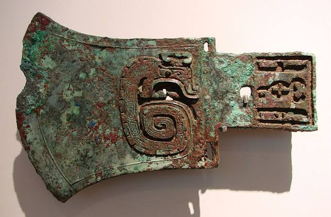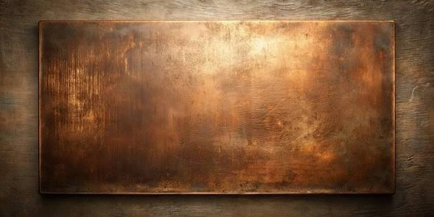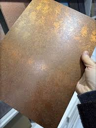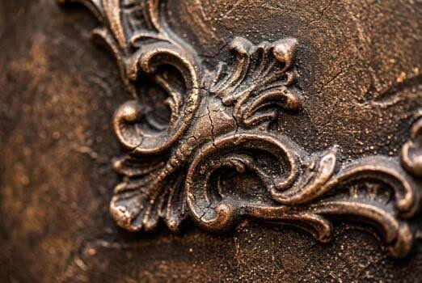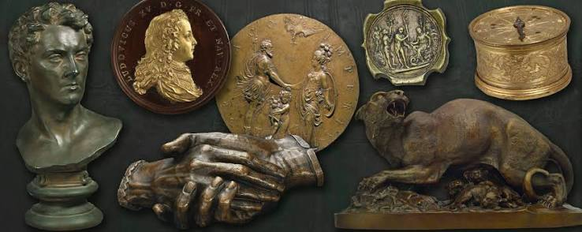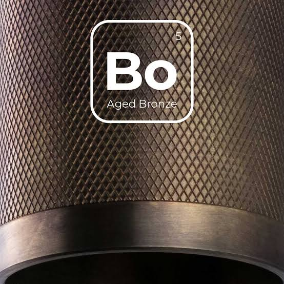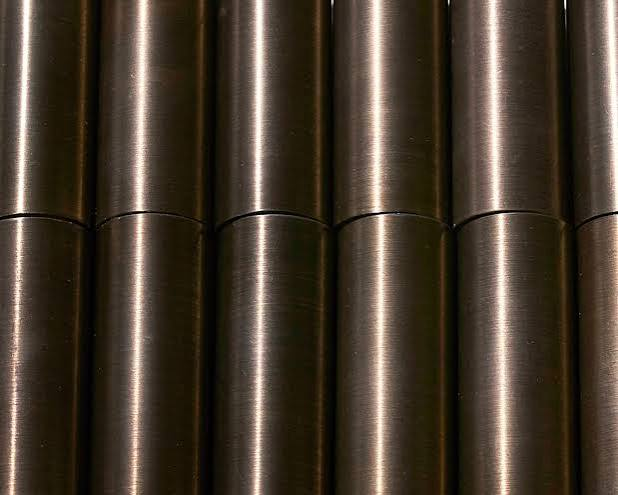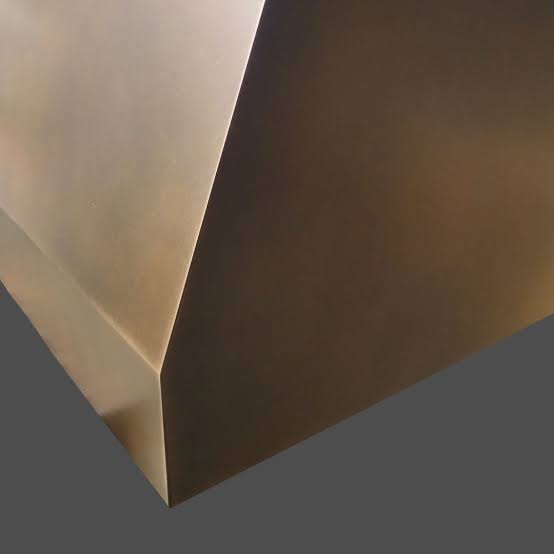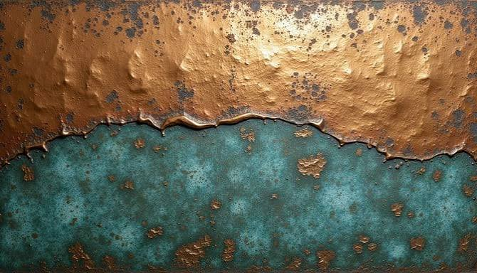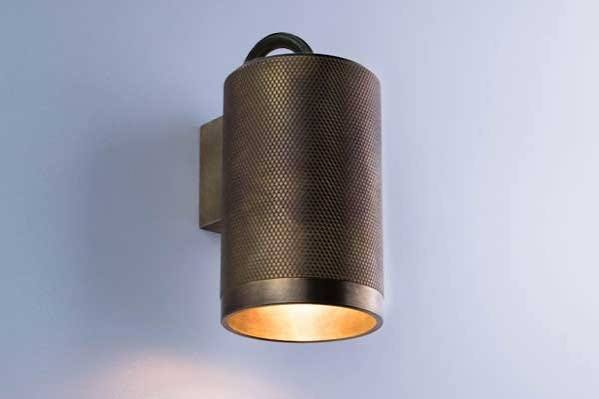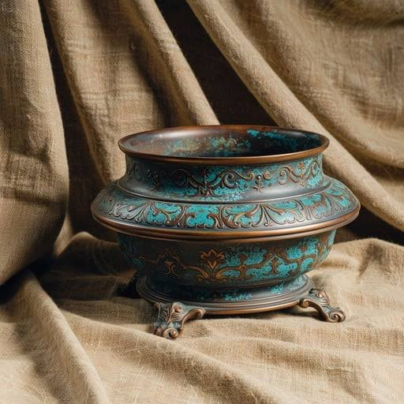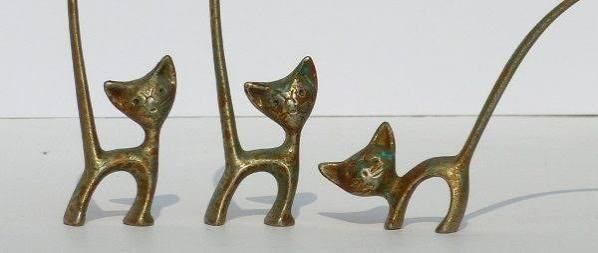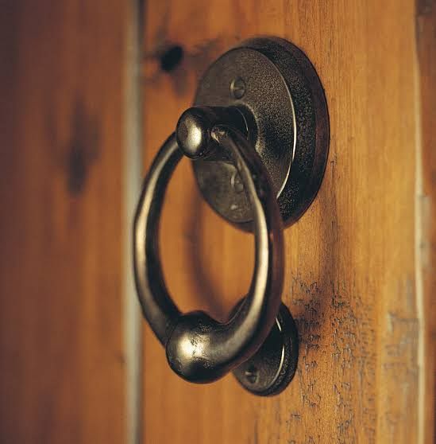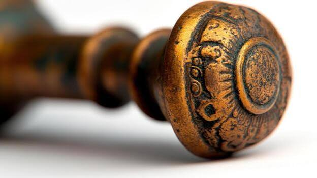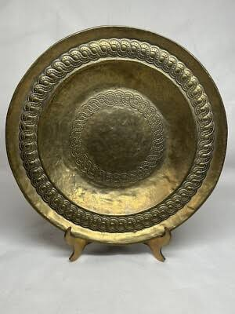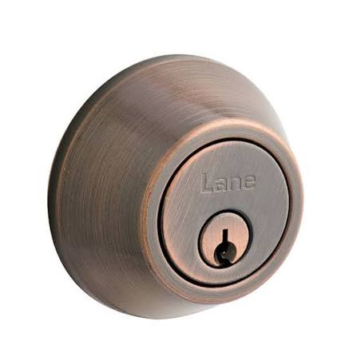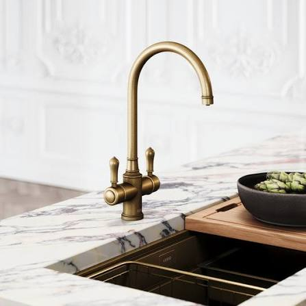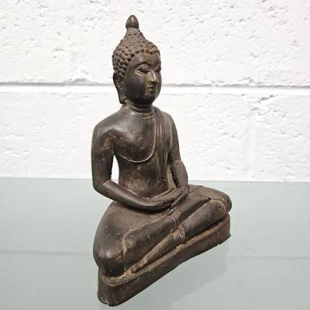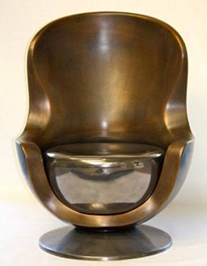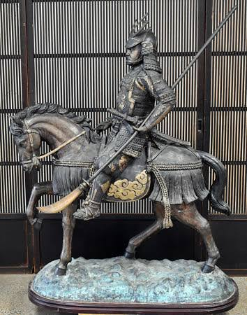
