# Obsidian

## Purpose

Primary foundation material for Sovereign Codex.

---

## Why it was selected

Obsidian communicates permanence, precision and quiet luxury without relying on ornamentation.

Unlike polished marble or glossy black paint, obsidian has depth. It absorbs light while reflecting only along fractured edges, creating subtle contrast and visual weight.

---

## Characteristics

- Nearly black, never pure black
- High depth
- Organic fractured geometry
- Glass-like reflections
- Violet undertones in some lighting
- Ancient natural material
- Premium without appearing extravagant

---

## Design Translation

### Backgrounds

Dark charcoal rather than pure black.

### Surfaces

Smooth with restrained highlights.

### Borders

Thin reflective edges.

### Lighting

Low-key lighting with controlled reflections.

---

## References

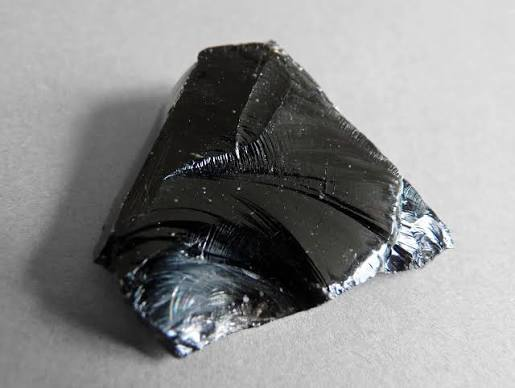
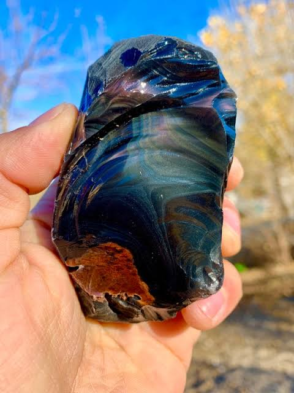
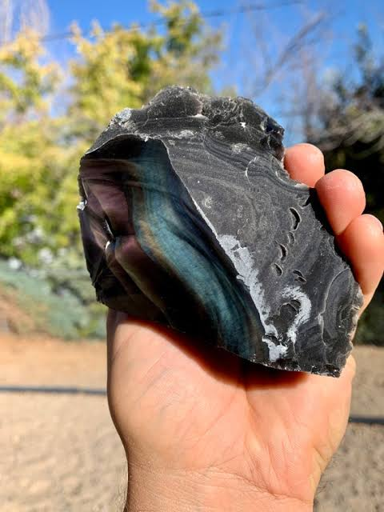
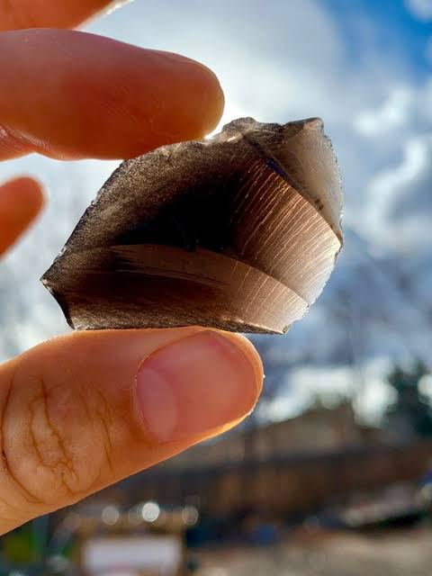
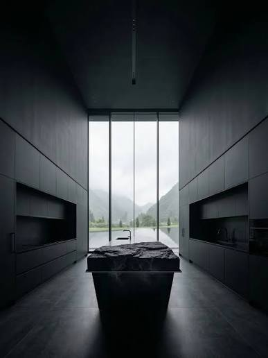
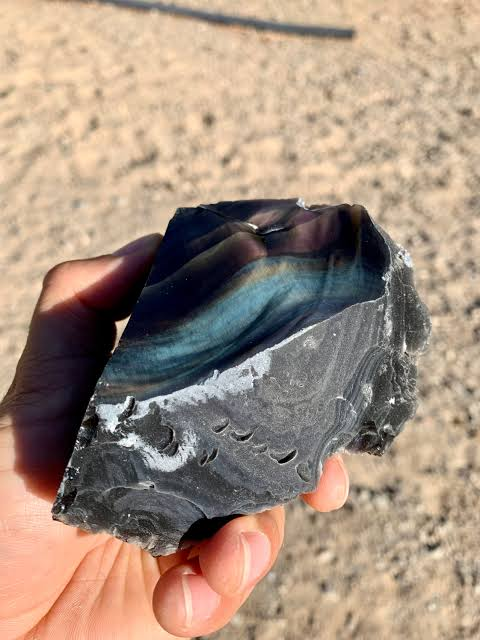
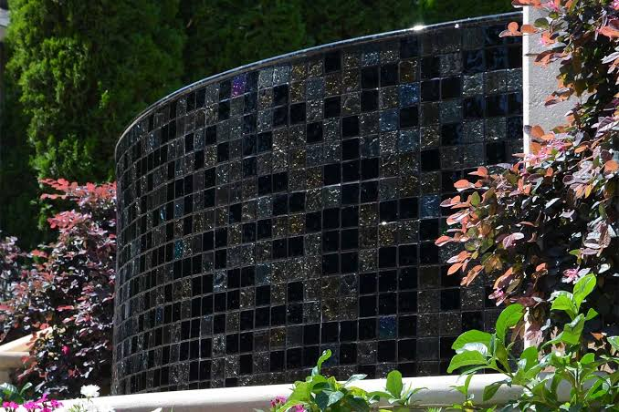
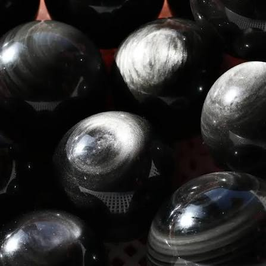
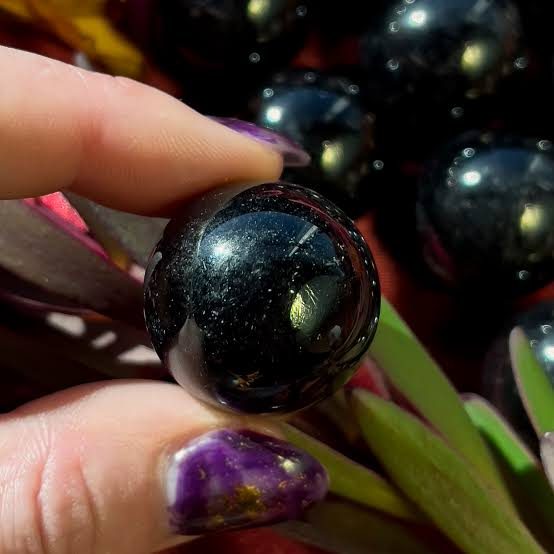
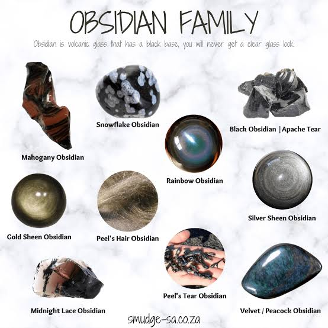
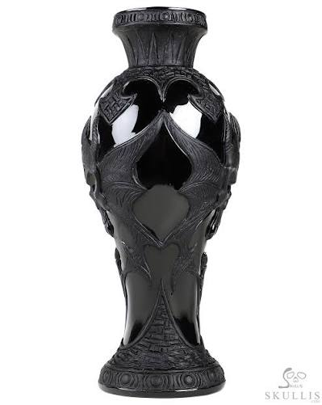
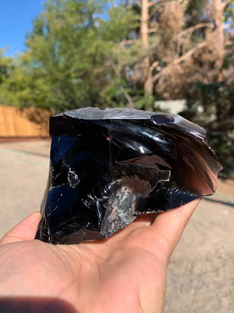
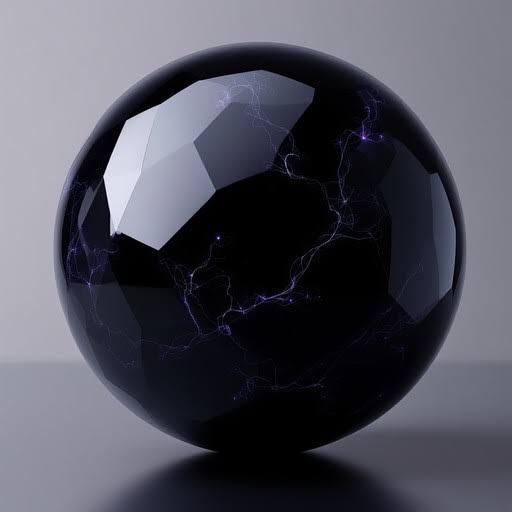
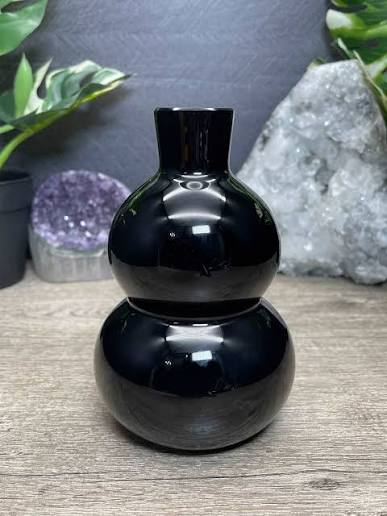
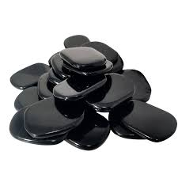

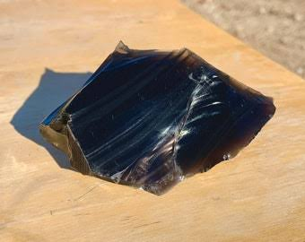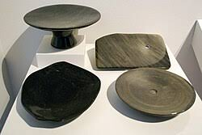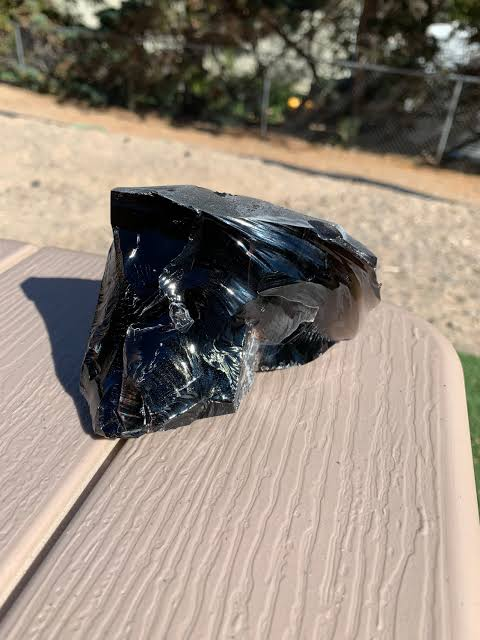

## Notes

Observations collected during design exploration.

🪨 1. Obsidian (Foundation)

Represents

Permanence
Foundation
Depth
Integrity

Used For

Backgrounds
Navigation
Large surfaces
Hero sections

What we were looking for

Volcanic glass
Near-black
Reflective edges
Organic fractures
Depth rather than pure black

What I think Obsidian is teaching us

After looking through your collection, here's what stands out.

It isn't just "black."

It's:

Light is concentrated.
Reflections are restrained.
Surfaces feel deep rather than bright.
Edges reveal the material.
Fractures are beautiful.
Imperfections add authenticity.
Colour exists inside the material, not on top of it.

That last point might actually become one of our guiding principles.

Colour should appear to emerge from the material, rather than being painted onto it.

Material: Obsidian

Status:
✓ Research Complete

✓ Initial References Approved

✓ Material Characteristics Defined

✓ Design Translation Documented

Next Review:
When implementing CSS or if a significantly stronger reference is discovered.