## Characteristics

- Warm, natural whites
- Soft texture
- Fine fibres
- Handcrafted quality
- Gentle contrast
- Comfortable for extended reading
- Timeless rather than aged

---

## Design Translation

Parchment represents readability.

Applications include:

- Page backgrounds
- Reading surfaces
- Documentation
- Long-form content
- Block quotes
- Examples

Avoid using parchment to imitate historical documents.

Instead, use it to communicate care, craftsmanship, and respect for knowledge.

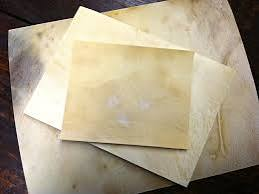
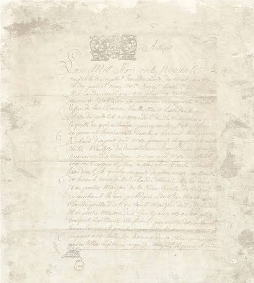
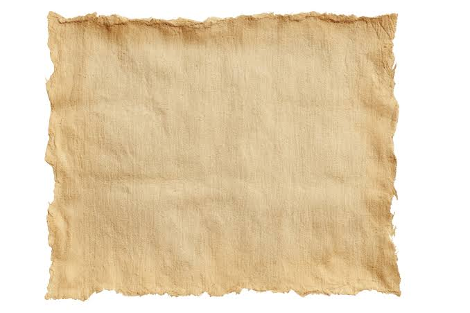
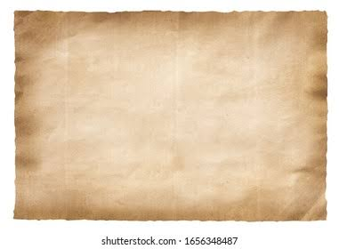
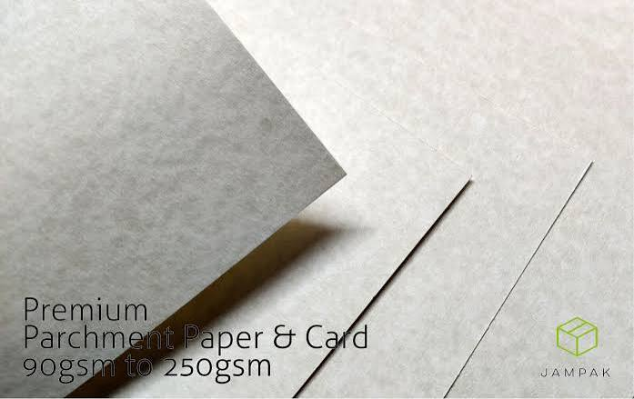
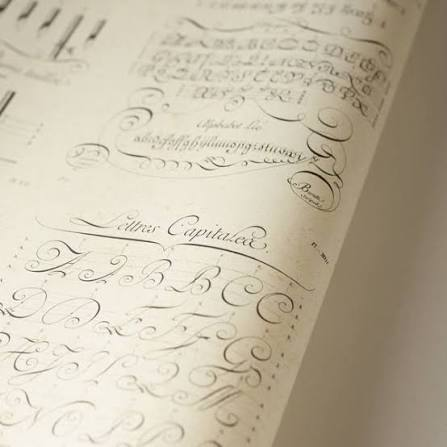
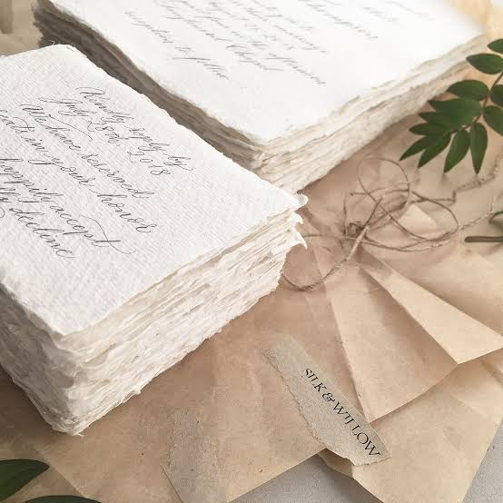
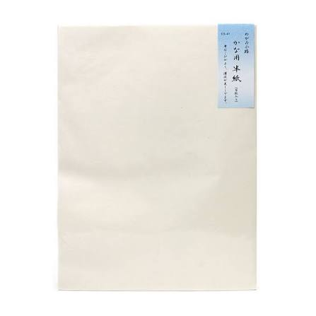
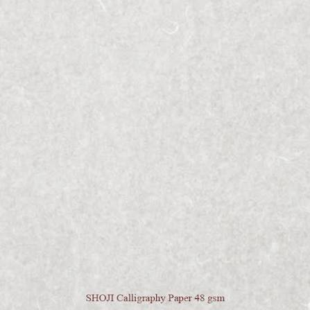

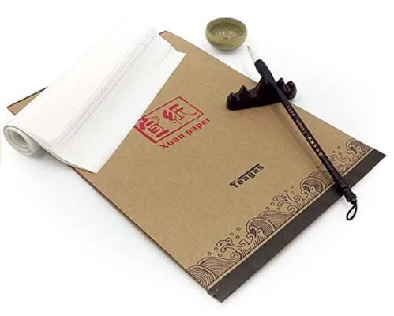

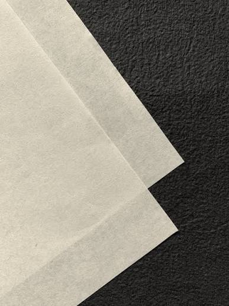
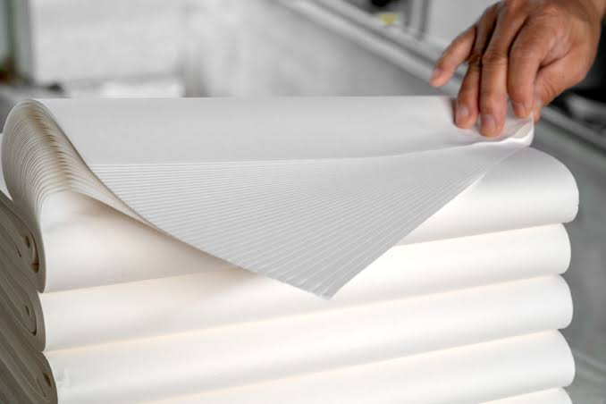
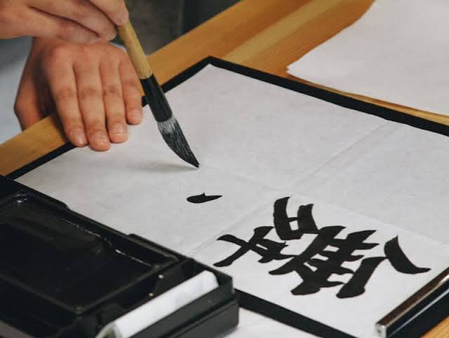
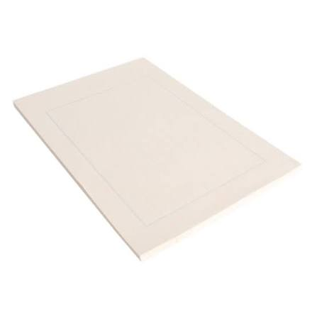

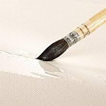
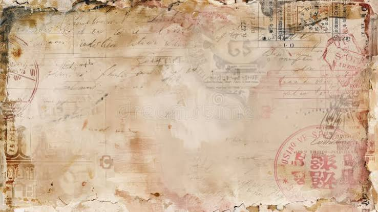
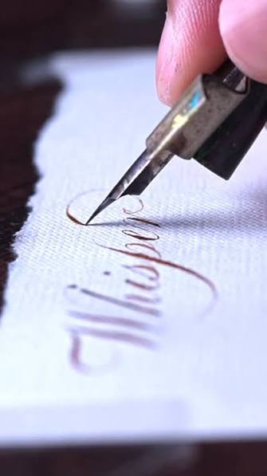
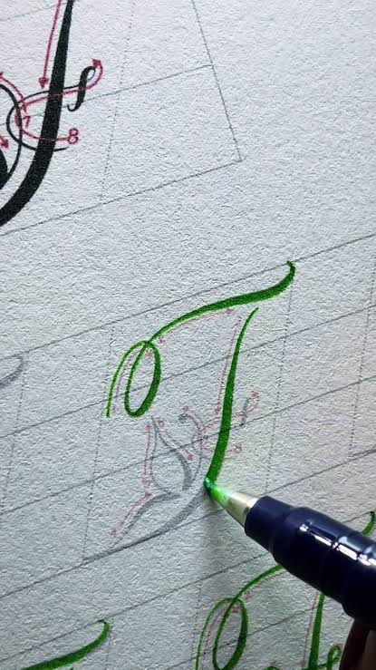