## Characteristics

- Deep blue with exceptional depth
- Colour intensifies under light
- Precision-cut geometry
- Cool rather than vibrant
- Highly restrained
- Naturally draws attention

---

## Design Translation

Sapphire should represent interaction.

Use it where the interface communicates:

- Active state
- Focus
- Selection
- Hyperlinks
- Search
- Discovery
- Progress

Avoid using sapphire as a primary surface colour.

It should guide attention, not dominate it.

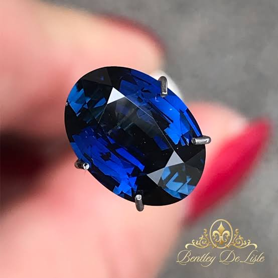
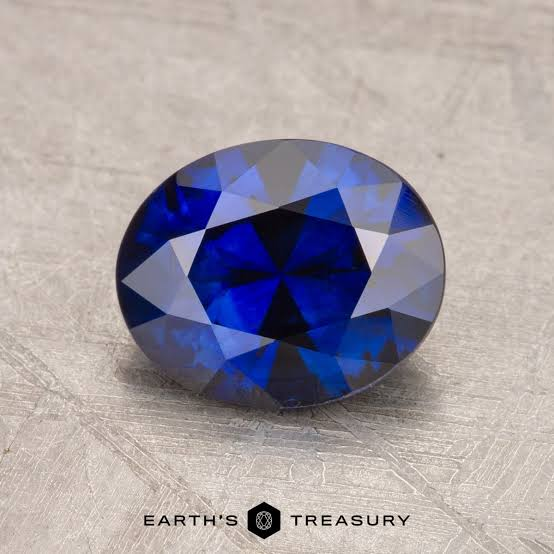
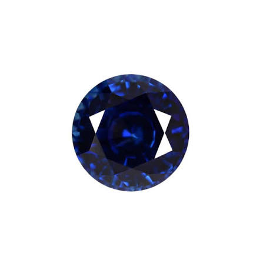
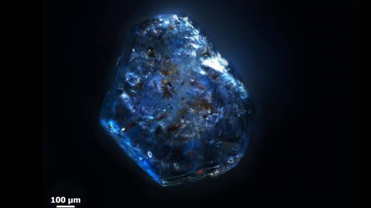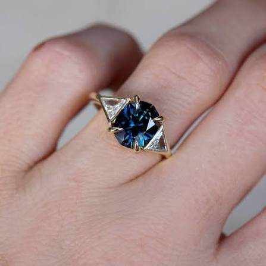
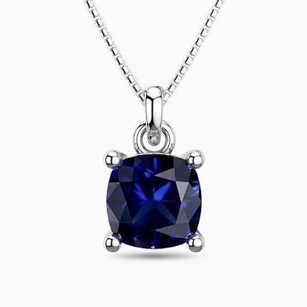
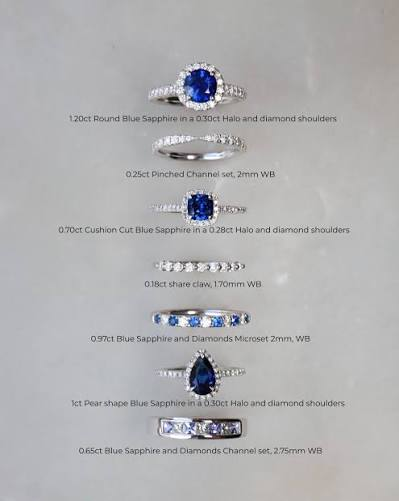
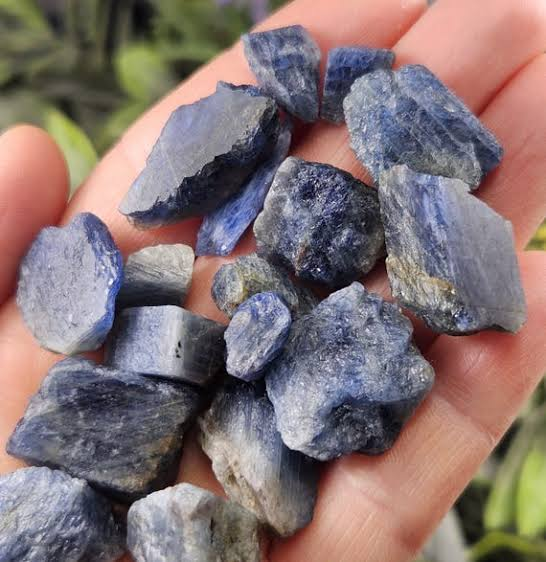
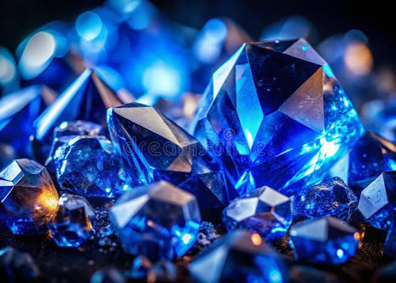
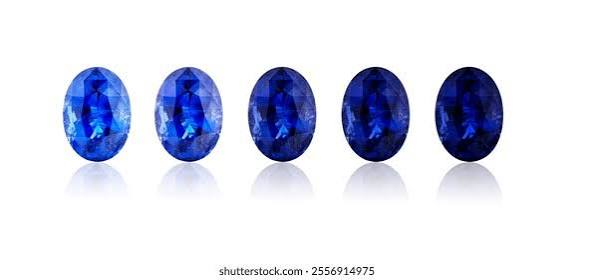
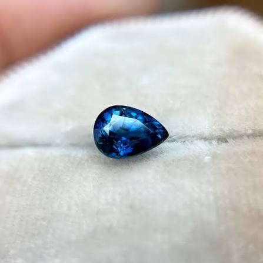
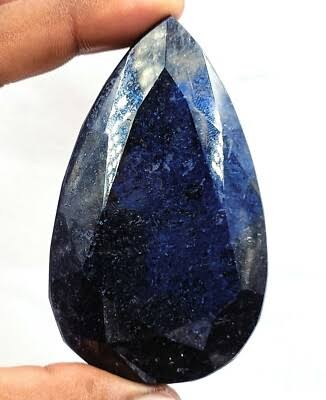
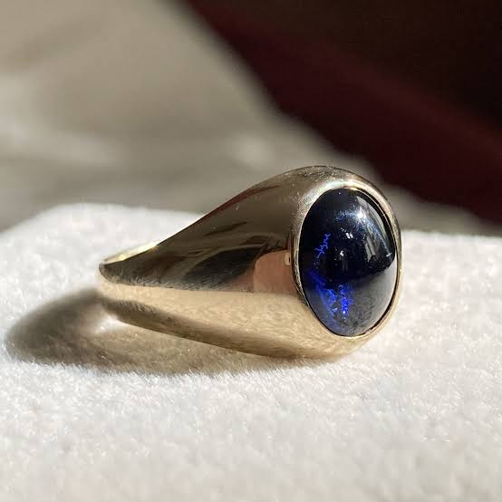
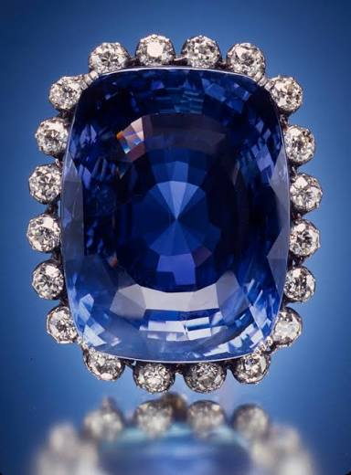
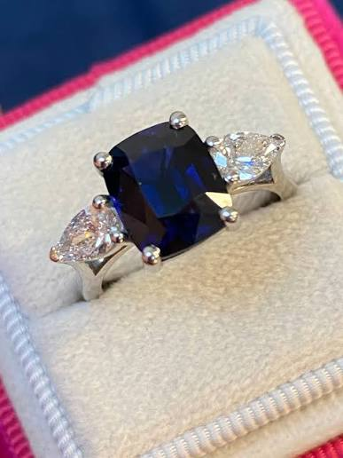
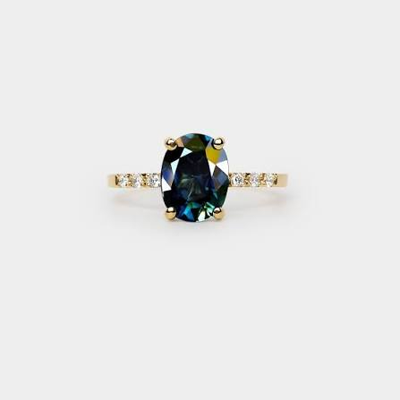
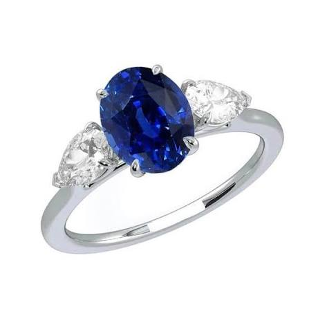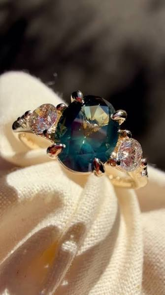
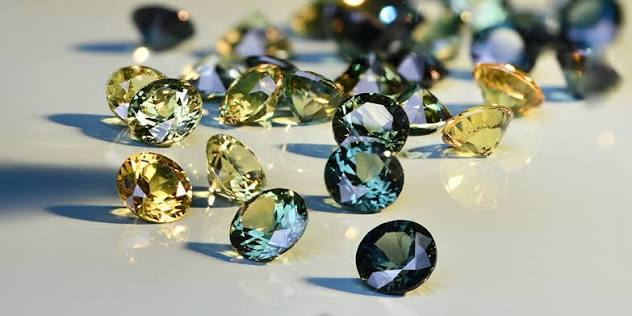
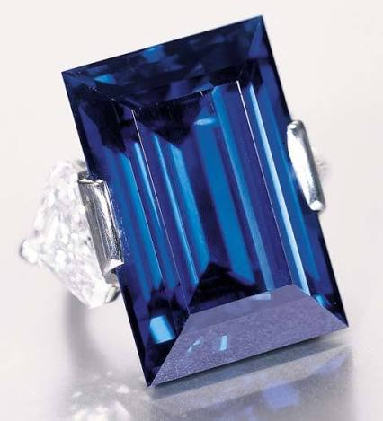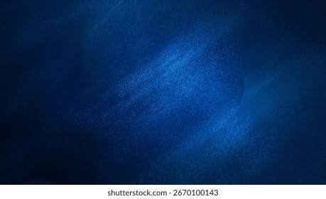
