Surface finish, machining, edge treatment
⚙️ 2. Forged Steel (Structure)

Represents

Engineering
Precision
Craftsmanship
Machinery

Used For

Borders
Dividers
UI structure
Icons
Components

What we're looking for

Brushed finish
Machined edges
Tool marks
Forged texture
Titanium
Gunmetal
Precision manufacturing

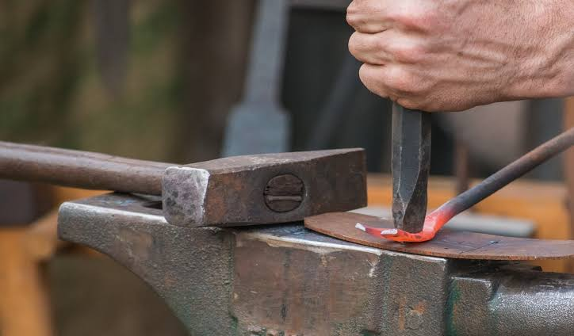
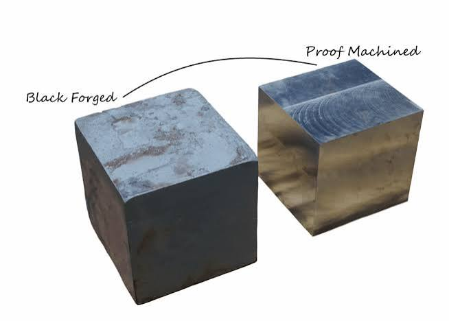
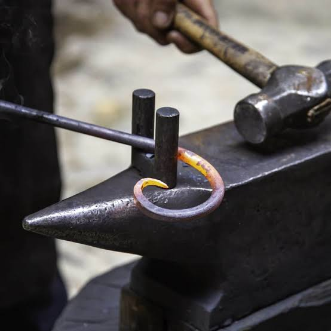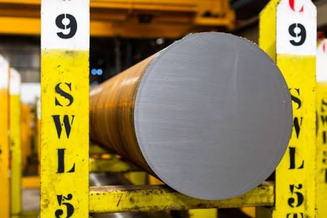
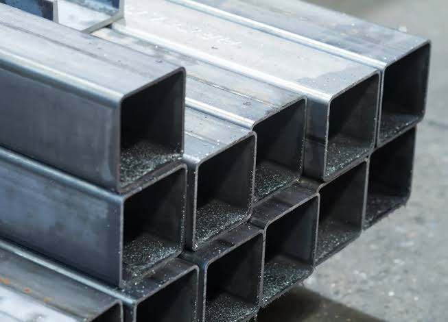
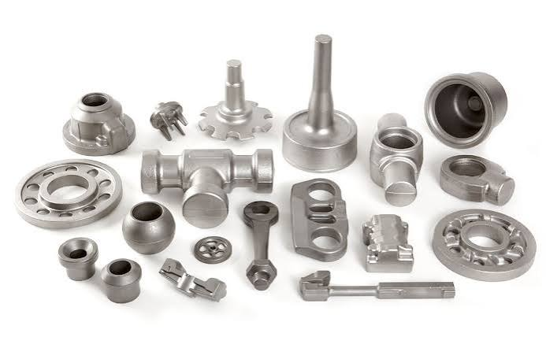
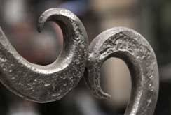
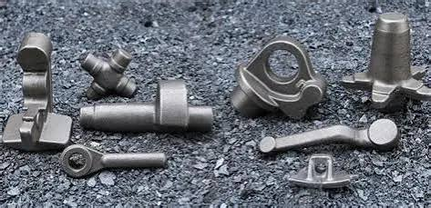
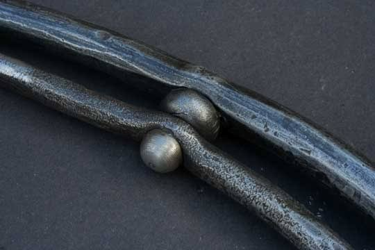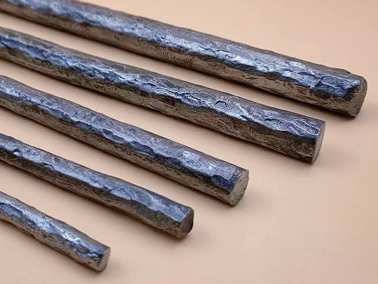
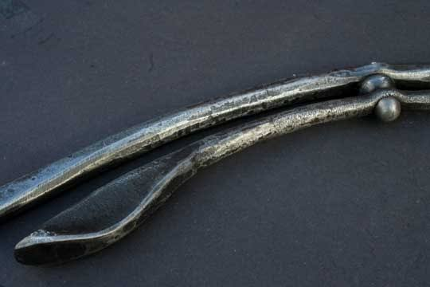
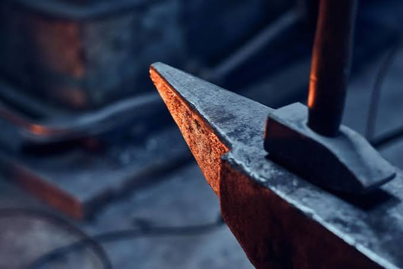
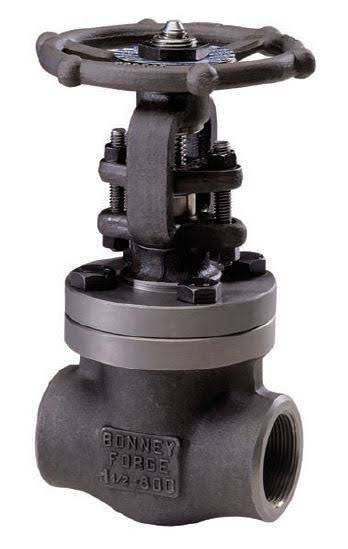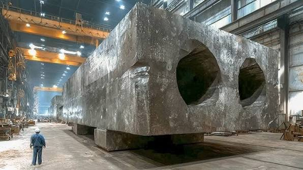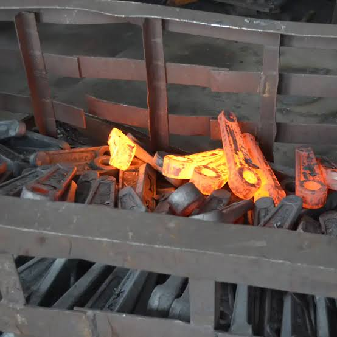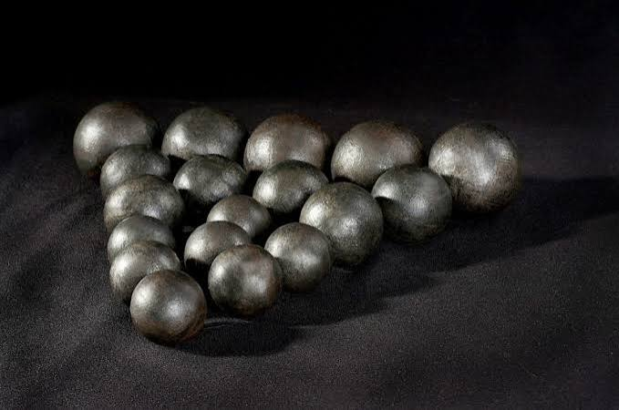
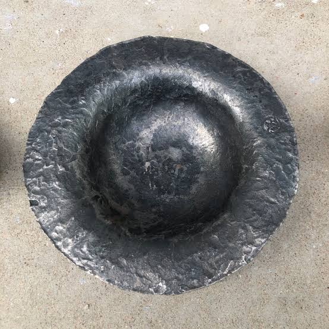
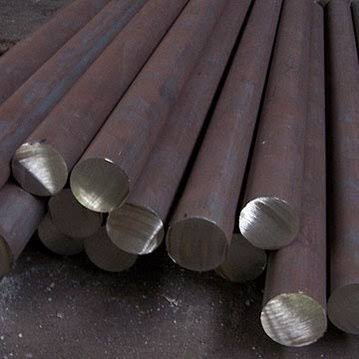
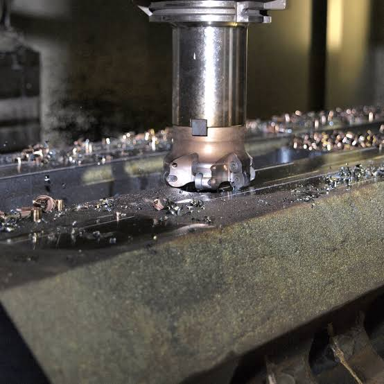
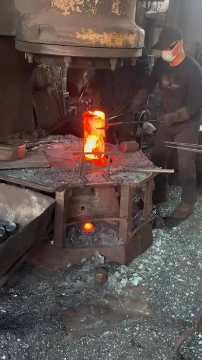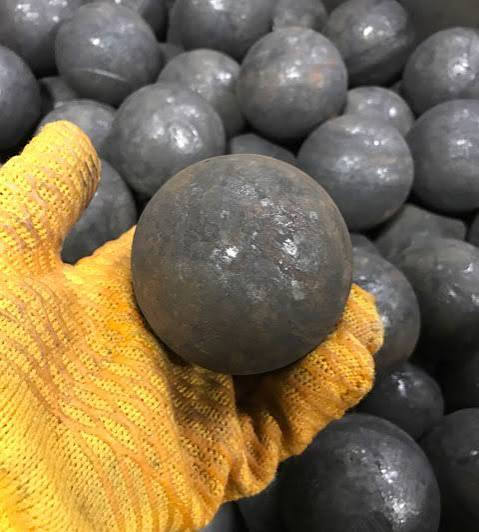
